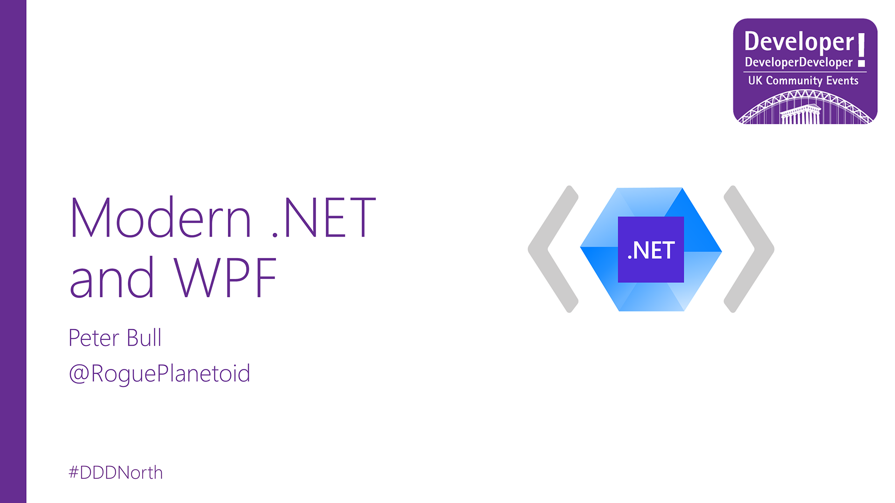

# Modern .NET and WPF?

## Presentation

Here you can find my "Modern .NET and WPF?" Slides and Demo

## Links

- [tutorialr.com](https://www.tutorialr.com/)
- [dot.net](https://www.dot.net/)
- [asp.net](https://www.asp.net/)
- [blazor.net](https://www.blazor.net/)
- [avaloniaui.net](https://www.avaloniaui.net])
- [platform.uno](https://platform.uno/)
- [dotnet.microsoft.com/apps/maui](https://dotnet.microsoft.com/apps/maui)
- [learn.microsoft.com/windows/apps/windows-app-sdk](https://learn.microsoft.com/windows/apps/windows-app-sdk/)
- [learn.microsoft.com/en-gb/dotnet/desktop/winforms](https://learn.microsoft.com/en-gb/dotnet/desktop/winforms/)
- [learn.microsoft.com/en-gb/dotnet/desktop/wpf](https://learn.microsoft.com/en-gb/dotnet/desktop/wpf/)
- Peter Bull [@RoguePlanetoid](https://www.twitter.com/RoguePlanetoid)

